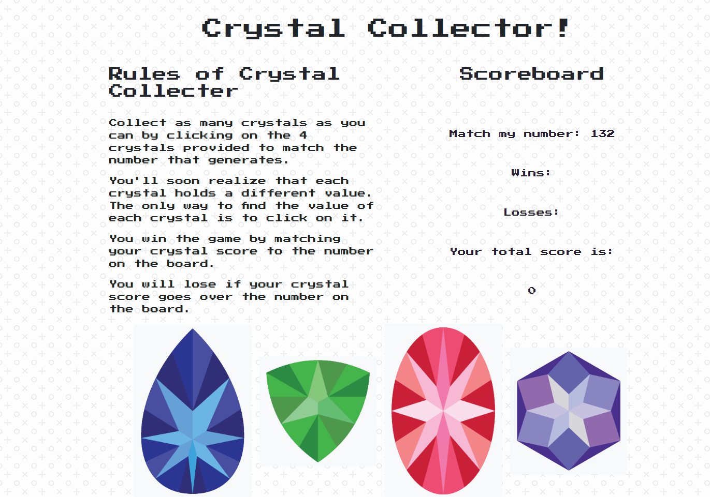

# Crystal-Collector
A responsive jQuery game.

# Rules of Crystal Collector

Collect as many crystals as you can by clicking on the 4 crystals provided to match the number that generates.

You'll soon realize that each crystal holds a different value. The only way to find the value of each crystal is to click on it.

You win the game by matching your crystal score to the number on the board.

You will lose if your crystal score goes over the number on the board.

## Deployed version

https://yutsukushi.github.io/Crystal-Collector/

## Technologies used

* HTML/CSS
* Bootstrap
* JavaScript
* jQuery

## Developer

All aspects of the project coded by Yukie Kushibiki
